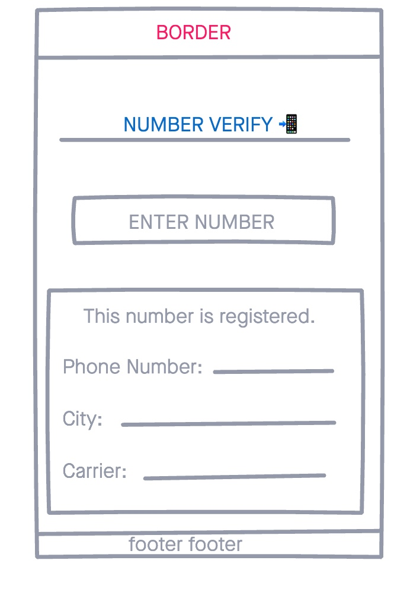
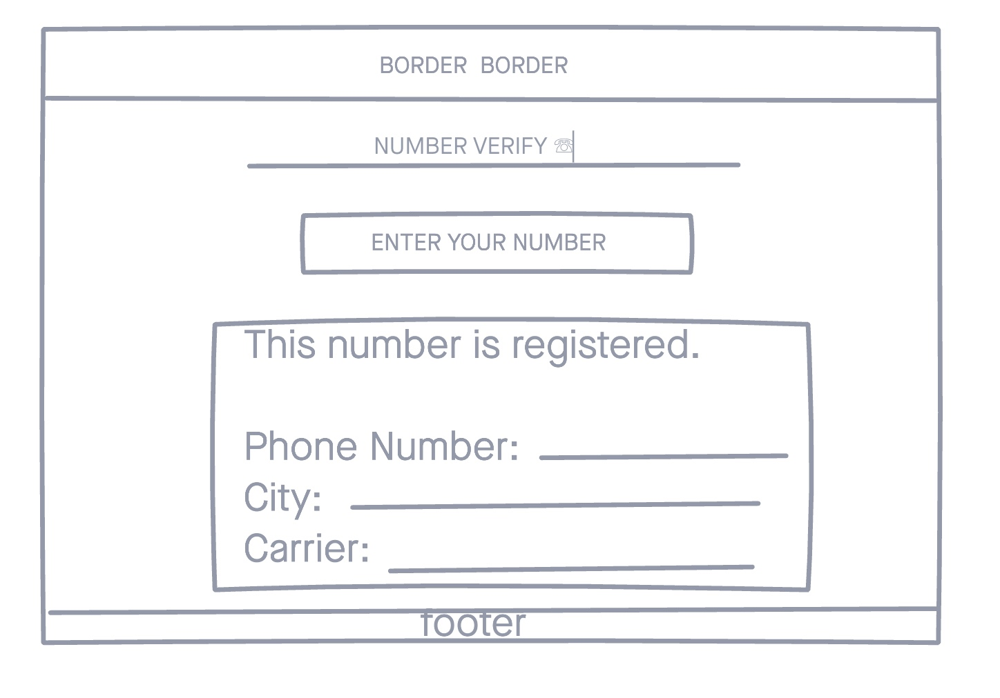
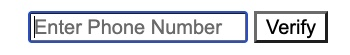
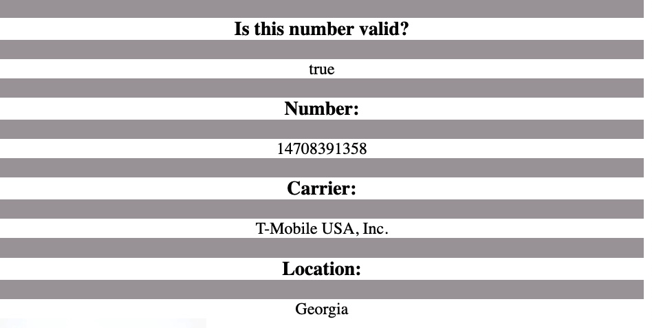

# Number Verify 📲

Number Verify allows you to check US and International numbers, and verify if they are registered with a carrier.

If the number is registred Numnber Verify will return the number with city and carrier info. 

# Technologies 
- HTML5
- CSS3     
- JavaScript/jQuery      
- [Number Verify](https://app.abstractapi.com/api/phone-validation)

# Visuals

Mobile

Desktop

# Getting Started 
*click here to see deployed app*

Enter your number in the field and press "Enter" or "Verify".

Information on the number searched will return the following info

# Future Enhancements
- The ability to save searches 
- Verify international numbers

Thanks for enjoying Number Verify.

Copyright © 2021 LebotApps 